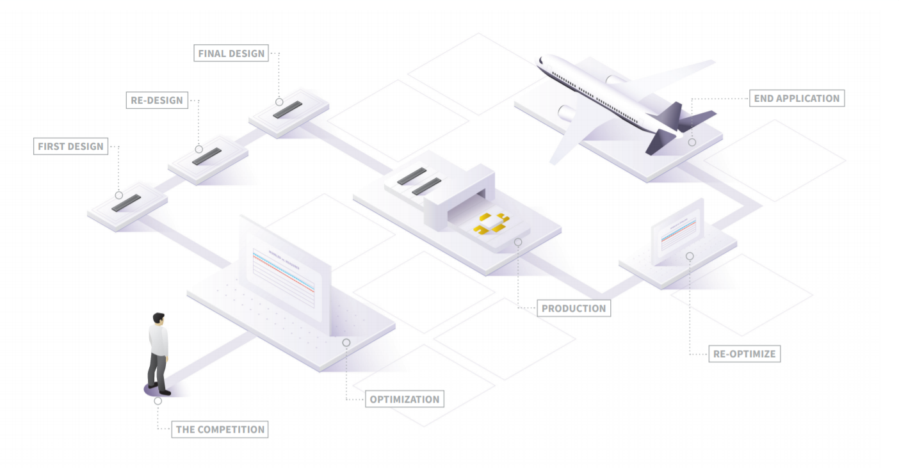

---
# Title, summary, and page position.
linktitle: Introduction
summary: 
weight: 1
icon: book
icon_pack: fas

# Page metadata.
title: Introduction
date: "2021-05-09T00:00:00Z"
type: book  # Do not modify.
---
The increasing demand for commercial applications, like cellular and personal communication services, broadband access, 3G mobile systems, radio frequency (RF) and microwave power amplifiers, has encouraged research in the field of high power and high frequency devices. The power amplifier technologies like bipolar transistor, GaAs MESFETs, and
GaN HEMTs are being used for developing these applications. These wide bandgap semiconductor technologies have prime importance in high power devices. Also the fast switching devices with better performance at higher frequency than conventional devices have increasing demand.

 
Credits: https://www.wolfspeed.com/

 

The wide bandgap materials can reliably work under large range of temperature values, because these materials have relatively less intrinsic carrier concentration and shows extrinsic behavior for wide range of temperature. The junctions formed in these devices will not become leaky at sufficiently large temperature. The material used in the high
power devices must support higher breakdown characteristics, so that device can be operated at higher voltages and supports sufficient current requirement. The wide band gap III-V semiconductor material GaN is found to be more promising for high power and high frequency device applications. The typical material properties of GaN results advantages for developing high power and high frequency applications.

| Parameters                   	| Si   	| GaN  	| SiC  	| AlN 	| GaAs 	|
|------------------------------	|------	|------	|------	|-----	|------	|
| Energy Bandgap               	| 1.1  	| 3.39 	| 2.86 	| 6.2 	| 1.43 	|
| Breakdown electric field     	| 0.3  	| 3.9  	| 2    	| -   	| 0.4  	|
| Relative dielectric constant 	| 11.8 	| 9    	| 10   	| 8.5 	| 12.8 	|
| Electron mobility            	| 1350 	| 1200 	| 650  	| 300 	| 8500 	|
| Saturated electron velocity  	| 1    	| 2.5  	| 2    	| 1.5 	| 2    	|

 
 The materials properties of GaN compared to the competing materials
